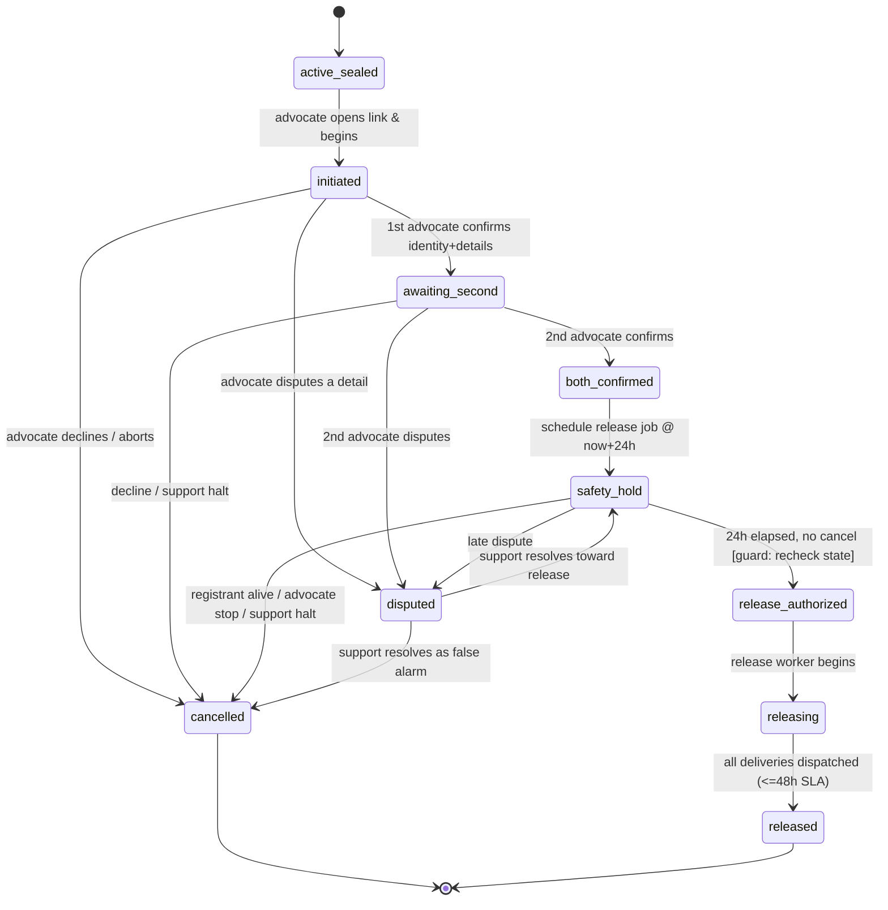
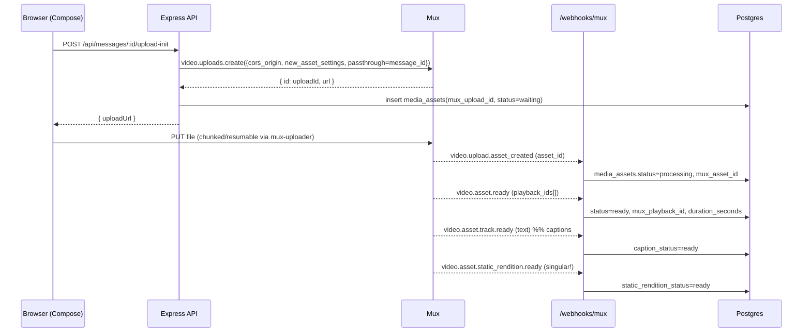
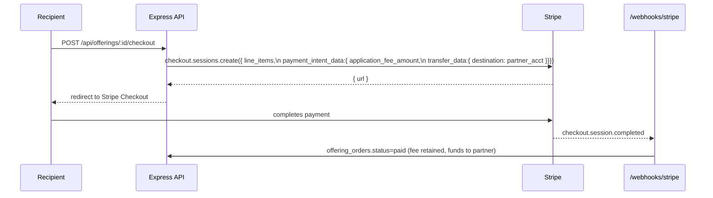

# LastLink — Technical Architecture & Development Plan

**Version:** 1.0 (MVP) · **Date:** June 2026 · **Status:** Build-ready
**Audience:** Engineering. Read alongside `LastLink-PRD.md` (product scope & acceptance criteria) and `LastLink-Spec.md` (research groundwork & vendor specifics).

> This document is the engineering source of truth for the LastLink MVP. It is intentionally concrete: schema DDL, API contracts, the verification state machine, the video pipeline, key custody, and a phased dev plan you can turn into tickets immediately. Where a claim or design needs legal/security sign-off it is flagged ⚠️.

---

## Table of Contents
1. [System overview](#1-system-overview)
2. [Tech stack & versions](#2-tech-stack--versions)
3. [Monorepo structure](#3-monorepo-structure)
4. [Environments & infrastructure](#4-environments--infrastructure)
5. [Authentication & authorization](#5-authentication--authorization)
6. [Data model (DDL)](#6-data-model-ddl)
7. [API surface](#7-api-surface)
8. [The verification engine](#8-the-verification-engine)
9. [Video pipeline (Mux)](#9-video-pipeline-mux)
10. [Encryption & key management](#10-encryption--key-management)
11. [Notification service (Resend + Twilio)](#11-notification-service-resend--twilio)
12. [Payments & offerings (Stripe Connect)](#12-payments--offerings-stripe-connect)
13. [Recipient access & token model](#13-recipient-access--token-model)
14. [Enterprise console](#14-enterprise-console)
15. [Observability, security & ops](#15-observability-security--ops)
16. [Testing strategy](#16-testing-strategy)
17. [Development plan](#17-development-plan)
18. [Risk register](#18-risk-register)

---

## 1. System overview

LastLink is five front-end surfaces over one backend. The backend is split between **Hasura** (typed CRUD over Postgres with row-level security — the bulk of registrant-facing reads/writes) and an **Express API** (the sensitive, side-effectful operations that must never be a raw DB mutation: verification, release, token issuance, video-upload initiation, and all third-party webhooks).

```
                         ┌──────────────────────────────────────────────┐
   Surfaces              │                  Clients                      │
                         │  marketing(SSG)  app  advocate  message   HR  │
                         └───────┬──────────────┬───────────────┬───────┘
                                 │ GraphQL       │ REST           │ REST (webhooks in)
                                 ▼               ▼                ▼
                         ┌───────────────┐  ┌──────────────────────────────┐
   Edge / API            │   Hasura v2   │  │        Express 5 API         │
                         │  (RLS, JWT)   │  │  auth · verification · video │
                         │               │  │  tokens · webhooks · pay     │
                         └──────┬────────┘  └───────┬───────────┬──────────┘
                                │                   │           │
                                ▼                   ▼           ▼
                         ┌──────────────┐   ┌──────────────┐  ┌────────────┐
   Data / async          │ Neon Postgres│   │   pg-boss    │  │    KMS     │
                         │ app/audit/ent│   │ (in same DB) │  │ (KEK wrap) │
                         └──────────────┘   └──────┬───────┘  └────────────┘
                                                   │
                                                   ▼
                         ┌─────────────────────────────────────────────────┐
   Workers               │ release-worker · notification-worker · media-recon│
                         └─────────────────────────────────────────────────┘
                                                   │
                  ┌────────────────┬───────────────┼─────────────┬─────────────┐
   Third parties   ▼                ▼               ▼             ▼             ▼
                  Mux            Resend          Twilio        Stripe       Better Auth
              (video)          (email)          (SMS)       (offerings)    (sessions)
```

**Key architectural decisions:**

- **Hasura for CRUD, Express for consequence.** Anything that can be expressed as permission-scoped CRUD (contacts, groups, draft messages, dashboard reads) goes through Hasura with RLS. Anything that triggers an irreversible or cross-system effect (confirming a death, authorizing release, minting a playback token, charging a card) is an explicit Express endpoint with its own guards, idempotency, and audit writes. **A death confirmation is never a GraphQL mutation.**
- **Single Postgres, multiple schemas — deviation from HSAI's dual-DB.** HSAI splits a read-heavy property catalog from app state. LastLink has no equivalent read-heavy catalog, so a second database adds operational cost with no benefit. Instead: one Neon database with three schemas — `app` (operational), `audit` (append-only, restricted grants), `enterprise` (B2B). This preserves HSAI's separation-of-concerns intent while staying simple. Revisit if the audit/compliance store needs physical isolation.
- **pg-boss, not Redis.** Durable time-holds and delivery fan-out run on pg-boss inside the same Postgres (transactional with state changes, no extra infra). See [§8](#8-the-verification-engine).
- **Advocate and recipient access is token-scoped, not full accounts.** They arrive via tokenized links and authenticate with lightweight identity checks; the Express API mints short-lived scoped JWTs for them. Only registrants and org admins get full Better Auth sessions. See [§13](#13-recipient-access--token-model).

---

## 2. Tech stack & versions

Mirrors the HSAI house standard except where noted. Pin these in `package.json` / `.tool-versions`.

| Layer | Technology | Notes / deviation |
|---|---|---|
| Runtime | Node.js 24 LTS | — |
| Package manager | pnpm 10 via Vite+ | Use `vp` wrapper; never `npm`/`npx`/`yarn` |
| Build toolchain | Vite+ (Vite 8, Rolldown, Oxlint, Oxfmt, Vitest) | — |
| Frontend | React 19 + TypeScript + Shadcn/Tailwind | All 5 surfaces |
| Marketing site | React 19, **statically pre-rendered** | SSG/SSR for SEO; marketing is the only indexed surface |
| Backend API | Express 5 + TypeScript | Sensitive ops, webhooks, token issuance |
| Admin (enterprise) | React Admin 5 + MUI 7 | HR console |
| Database | PostgreSQL 17.x on Neon | Single DB, 3 schemas (not dual-DB) |
| GraphQL | Hasura v2 (RLS) | `cli-migrations-v2` image |
| Auth | Better Auth (cross-subdomain) | Registrants + org admins only |
| Job queue | **pg-boss** (in Postgres) | NEW vs HSAI — durable holds/fan-out |
| Video | **Mux** (`@mux/mux-node`, `@mux/mux-uploader-react`, `@mux/mux-player-react` 3.x) | NEW — see [§9](#9-video-pipeline-mux) |
| Email | **Resend** + React Email | NEW — transactional + marketing on separate subdomains |
| SMS | **Twilio** | NEW — Resend has no SMS; required for Email+SMS |
| Payments | Stripe Connect (destination charges) | Partner offerings only |
| Key management | **AWS KMS** (or GCP Cloud KMS) | NEW — envelope encryption, [§10](#10-encryption--key-management) |
| Messaging | CometChat | **Deferred** — "reply to the deceased" is post-MVP; stub the inbox |
| AI | OpenAI (Vercel AI SDK) / Anthropic (BAML) | **Deferred** — gentle-prompt suggestions only, optional |
| Testing | Vitest (unit) + Playwright (E2E) | Critical-path E2E mandatory |
| Hosting | Render.com (prod/staging/dev) | Custom domains required (see [§4](#4-environments--infrastructure)) |
| Error tracking | Sentry (or equivalent) | NEW |

---

## 3. Monorepo structure

```
lastlink/
├── apps/
│   ├── marketing/        # React 19 SSG          → lastlink.com
│   ├── app/              # Registrant SPA        → app.lastlink.com  (#onboarding/#dashboard/#compose/#contacts/#advocates)
│   ├── advocate/         # Advocate flow         → advocate.lastlink.com (token-gated, noindex)
│   ├── message/          # Recipient experience  → msg.lastlink.com (token-gated, noindex)
│   ├── enterprise/       # HR console (React Admin) → hr.lastlink.com (SSO)
│   ├── api/              # Express 5 API         → api.lastlink.com
│   └── workers/          # pg-boss workers       → (background service, no public port)
├── packages/
│   ├── shared/           # @lastlink/shared — TS types, zod schemas, constants, enums (state machine, plans)
│   ├── crypto/           # @lastlink/crypto — envelope encryption helpers, KMS client wrapper
│   ├── notifications/    # @lastlink/notifications — NotificationService (Resend + Twilio), React Email templates
│   ├── verification/     # @lastlink/verification — state machine, guards, transition validators
│   └── ui/               # @lastlink/ui — Shadcn components, brand atoms (Logo, butterfly mark, ImgSlot)
├── hasura/               # migrations, metadata, docker-compose
├── db/                   # raw SQL: schemas, grants, audit triggers, seed
├── tests/e2e/            # Playwright
├── render.yaml           # Blueprint (see §4 caveats)
└── documents/            # PRD, Architecture, Spec
```

**Why `verification`, `crypto`, and `notifications` are packages, not app code:** they encode the rules that must be identical everywhere they're referenced (the state machine is referenced by both the API and the workers; the crypto helpers by the API and the release worker). A single source prevents drift on exactly the logic where drift is catastrophic.

---

## 4. Environments & infrastructure

### 4.1 Render services

| Service | Type | Public | Notes |
|---|---|---|---|
| `marketing` | Static Site | ✅ CDN | Pre-rendered |
| `app` / `advocate` / `message` / `enterprise` | Static Site (SPA) | ✅ CDN | Or a single multi-entry build |
| `api` | Web Service | ✅ | Express 5; bind `0.0.0.0:$PORT` (default 10000) |
| `hasura` | Web Service | ✅ | `hasura/graphql-engine:*.cli-migrations-v2` |
| `workers` | **Background Worker** | ❌ | pg-boss workers; no inbound port |
| Postgres | Neon (external) | ❌ | Not Render Postgres — use Neon for branching |

Services communicate over Render's private network; only `api`, `hasura`, marketing, and the SPAs are public. Use **Environment Groups scoped per environment** to prevent staging↔prod credential bleed.

### 4.2 Neon branches

| Env | Branch | Compute | Scale-to-zero |
|---|---|---|---|
| Production | `main` | min set adequately, **no autosuspend** | ❌ (avoid cold starts on release path) |
| Staging | `staging` | small | ✅ 5 min idle |
| Development | `dev` + per-PR | small | ✅ |

Use Neon branching for per-PR previews; use **anonymized-data branches** (PostgreSQL Anonymizer) so dev/test never touches real PII. If a launch enterprise deal needs it, Neon's Scale tier carries a 99.95% SLA + PITR + SOC 2/HIPAA posture.

### 4.3 ⚠️ Hard infrastructure dependencies (do not skip)

- **Custom domains are mandatory in staging/prod.** `*.onrender.com` is on the Public Suffix List, so Better Auth cross-subdomain cookies will silently fail. Provision `lastlink.com` + subdomains before wiring auth.
- **Pin Hasura's migration server port** (`HASURA_GRAPHQL_MIGRATIONS_SERVER_PORT`) so Render doesn't mis-detect it and break deploys; always set `HASURA_GRAPHQL_ADMIN_SECRET` (console is open by default).
- **Render Blueprint multi-env is awkward** (often a two-branch setup: one for prod infra/`render.yaml`, one for code). Decide the prod/staging/dev mapping deliberately up front.
- **Webhook endpoints need the raw request body** (Mux, Resend/Svix, Stripe, Twilio all verify signatures over raw bytes). Mount `express.raw()` on webhook routes *before* any JSON body parser.

### 4.4 Environment variable checklist

```bash
# Core
NODE_ENV=production
APP_BASE_URL=https://app.lastlink.com
API_BASE_URL=https://api.lastlink.com
COOKIE_DOMAIN=.lastlink.com

# Database (per Neon branch)
DATABASE_URL=postgres://...                  # app role (RLS-scoped where used directly)
DATABASE_URL_MIGRATOR=postgres://...         # elevated; migrations only
DATABASE_URL_AUDIT_WRITER=postgres://...     # INSERT-only into audit schema

# Better Auth
BETTER_AUTH_SECRET=...
BETTER_AUTH_URL=https://api.lastlink.com

# Hasura
HASURA_GRAPHQL_ADMIN_SECRET=...
HASURA_GRAPHQL_JWT_SECRET={"type":"RS256","jwk_url":"https://api.lastlink.com/.well-known/jwks.json"}
HASURA_GRAPHQL_DATABASE_URL=postgres://...
HASURA_GRAPHQL_METADATA_DATABASE_URL=postgres://...
HASURA_GRAPHQL_MIGRATIONS_SERVER_PORT=9693

# Mux
MUX_TOKEN_ID=...
MUX_TOKEN_SECRET=...
MUX_WEBHOOK_SECRET=...
MUX_SIGNING_KEY_ID=...                        # RSA key for signed playback
MUX_SIGNING_KEY_PRIVATE_BASE64=...

# Resend
RESEND_API_KEY=...
RESEND_WEBHOOK_SECRET=...                      # Svix
RESEND_FROM_TRANSACTIONAL="LastLink <notify@notify.lastlink.com>"
RESEND_FROM_MARKETING="LastLink <hello@mail.lastlink.com>"

# Twilio
TWILIO_ACCOUNT_SID=...
TWILIO_AUTH_TOKEN=...
TWILIO_MESSAGING_SERVICE_SID=...

# Stripe
STRIPE_SECRET_KEY=...
STRIPE_WEBHOOK_SECRET=...

# KMS (AWS example)
AWS_REGION=us-east-1
KMS_KEK_KEY_ID=arn:aws:kms:...                 # platform KEK; release-gated IAM
# (release worker assumes a role permitted to kms:Decrypt; API role is NOT)

# Token signing (scoped advocate/recipient JWTs — separate from Better Auth)
RECIPIENT_TOKEN_SECRET=...
ADVOCATE_TOKEN_SECRET=...

# Ops
SENTRY_DSN=...
```

---

## 5. Authentication & authorization

### 5.1 Identity model

| Principal | Auth mechanism | Has Better Auth session? |
|---|---|---|
| Registrant | Email/password + 2FA (Better Auth) | ✅ |
| Org admin / case handler | SSO (Better Auth + OIDC) — MVP may use email/password | ✅ |
| Advocate | Tokenized email link → identity check → **scoped JWT** | ❌ (short-lived scoped token) |
| Recipient | Tokenized link → light verification → **scoped JWT** | ❌ |
| Platform admin | Better Auth + IP allowlist | ✅ |
| Anonymous (prospect) | none | — |

### 5.2 Better Auth config (registrants/admins)

```ts
// apps/api/src/auth.ts
export const auth = betterAuth({
  database: pgPool,
  secret: env.BETTER_AUTH_SECRET,
  baseURL: env.BETTER_AUTH_URL,
  trustedOrigins: ["https://app.lastlink.com", "https://hr.lastlink.com", "https://*.lastlink.com"],
  advanced: {
    crossSubDomainCookies: { enabled: true, domain: ".lastlink.com" },
    // subdomains => SameSite=Lax is fine; only go None;Secure;Partitioned if forced cross-site
  },
  emailAndPassword: { enabled: true, requireEmailVerification: true },
  twoFactor: { enabled: true },           // mandatory for registrants before account is "sealed"
  // JWT plugin issues RS256 tokens with Hasura claims (below) + exposes JWKS
});
```

### 5.3 JWT → Hasura claims

The Better Auth JWT carries a Hasura claims namespace. Express also mints scoped JWTs for advocates/recipients with the *same* Hasura claim shape but a restricted role.

```jsonc
{
  "sub": "user_abc",
  "https://hasura.io/jwt/claims": {
    "x-hasura-default-role": "registrant",
    "x-hasura-allowed-roles": ["registrant"],
    "x-hasura-user-id": "user_abc",
    "x-hasura-org-id": "org_123"          // present only for org admins
  }
}
```

Scoped advocate/recipient tokens (minted by Express, *not* Better Auth):

```jsonc
// recipient token
{ "sub": "contact_999", "scope": "recipient",
  "https://hasura.io/jwt/claims": {
    "x-hasura-default-role": "recipient",
    "x-hasura-allowed-roles": ["recipient"],
    "x-hasura-contact-id": "contact_999",
    "x-hasura-delivery-id": "del_555" },
  "exp": 900 }   // short-lived; re-minted on revisit after re-validation
```

### 5.4 Hasura roles & RLS patterns

Roles are flat: `registrant`, `advocate`, `recipient`, `org_admin`, `org_case_handler`, `platform_admin`, `anonymous`.

```yaml
# Example: registrant can only see their own contacts
table: app.contacts
role: registrant
permission:
  filter: { registrant_id: { _eq: "X-Hasura-User-Id" } }
  columns: [id, full_name, relationship, location, email, phone, reach_channels]

# Example: column preset auto-injects ownership on insert
insert_permission:
  set: { registrant_id: "X-Hasura-User-Id" }

# Example: recipient sees ONLY the message tied to their delivery
table: app.messages
role: recipient
permission:
  filter:
    deliveries: { id: { _eq: "X-Hasura-Delivery-Id" }, status: { _in: [delivered, sent] } }
  columns: [id, type, title, length_seconds]   # NO body_ciphertext, NO wrapped_dek
```

**Hard rule:** `body_ciphertext`, `wrapped_dek`, `dek_key_id`, and any Mux signing material are **never** exposed through Hasura to any role. Decryption and playback-token minting happen only in Express, post-release.

---

## 6. Data model (DDL)

Single Neon database, schemas `app` / `audit` / `enterprise`. Better Auth owns its own tables (`user`, `session`, `account`, `verification`) — domain tables reference `user.id` (text).

> Abbreviated to the columns that matter for the build. Add `created_at timestamptz default now()` / `updated_at` everywhere; use `gen_random_uuid()` PKs unless noted.

### 6.1 `app` schema — registrant core

```sql
create type plan_t          as enum ('free','premium');
create type account_state_t as enum ('onboarding','active_sealed','in_verification','released','closed');
create type message_type_t  as enum ('video','audio','letter');
create type message_state_t as enum ('draft','ready','released');
create type media_state_t   as enum ('waiting','processing','ready','errored');
create type advocate_slot_t as enum ('A','B');
create type invite_state_t  as enum ('pending','accepted','declined');
create type reach_channel_t as enum ('email','sms');

create table app.registrants (
  id            uuid primary key default gen_random_uuid(),
  user_id       text not null unique references "user"(id),  -- Better Auth
  legal_name    text not null,
  dob           date,
  country       text,
  plan          plan_t not null default 'free',
  account_state account_state_t not null default 'onboarding',
  sealed_at     timestamptz,
  created_at    timestamptz not null default now(),
  updated_at    timestamptz not null default now()
);

create table app.identity_verifications (
  id            uuid primary key default gen_random_uuid(),
  registrant_id uuid not null references app.registrants(id),
  status        text not null default 'pending',     -- pending|approved|rejected
  vendor        text,                                 -- ⚠️ choose vendor + SLA
  vendor_ref    text,
  gov_id_ref    text,                                 -- storage key (encrypted at rest)
  reviewed_at   timestamptz,
  created_at    timestamptz not null default now()
);

create table app.contact_groups (
  id            uuid primary key default gen_random_uuid(),
  registrant_id uuid not null references app.registrants(id),
  name          text not null,                        -- Family|Close friends|Business|custom
  is_default    boolean not null default false,
  created_at    timestamptz not null default now()
);

create table app.contacts (
  id            uuid primary key default gen_random_uuid(),
  registrant_id uuid not null references app.registrants(id),
  full_name     text not null,
  relationship  text,
  location      text,
  email         text,
  phone         text,
  reach_channels reach_channel_t[] not null default '{email}',
  created_at    timestamptz not null default now()
);

create table app.contact_group_members (
  group_id   uuid not null references app.contact_groups(id) on delete cascade,
  contact_id uuid not null references app.contacts(id) on delete cascade,
  primary key (group_id, contact_id)
);

create table app.media_assets (
  id                      uuid primary key default gen_random_uuid(),
  registrant_id           uuid not null references app.registrants(id),
  mux_upload_id           text,
  mux_asset_id            text,
  mux_playback_id         text,                       -- SIGNED policy
  playback_policy         text not null default 'signed',
  status                  media_state_t not null default 'waiting',
  duration_seconds        integer,
  caption_status          text default 'pending',     -- pending|ready|errored
  static_rendition_status text default 'pending',     -- pending|ready|errored
  thumbnail_ref           text,
  errored_reason          text,
  created_at              timestamptz not null default now(),
  updated_at              timestamptz not null default now()
);
create index on app.media_assets (mux_asset_id);
create index on app.media_assets (mux_upload_id);

create table app.messages (
  id               uuid primary key default gen_random_uuid(),
  registrant_id    uuid not null references app.registrants(id),
  group_id         uuid references app.contact_groups(id),
  type             message_type_t not null,
  title            text,
  status           message_state_t not null default 'draft',
  media_asset_id   uuid references app.media_assets(id),  -- video/audio
  body_ciphertext  bytea,                                  -- letters: AES-256-GCM ciphertext
  body_iv          bytea,
  wrapped_dek      bytea,                                  -- DEK encrypted by KMS KEK
  dek_key_id       text,                                   -- KMS key/version ref
  delivery_settings jsonb not null default '{}',           -- channel, reading order, aftercare flags, visibility
  created_at       timestamptz not null default now(),
  updated_at       timestamptz not null default now()
);
```

### 6.2 `app` schema — advocates, verification, release, delivery

```sql
create type case_state_t as enum (
  'initiated','awaiting_second','both_confirmed','safety_hold',
  'release_authorized','releasing','released','cancelled','disputed'
);
create type delivery_state_t as enum ('queued','sent','delivered','bounced','failed');

create table app.advocates (
  id                uuid primary key default gen_random_uuid(),
  registrant_id     uuid not null references app.registrants(id),
  slot              advocate_slot_t not null,           -- A or B
  full_name         text not null,
  relationship      text,
  email             text not null,
  phone             text,
  invite_status     invite_state_t not null default 'pending',
  identity_verified boolean not null default false,
  invited_at        timestamptz not null default now(),
  accepted_at       timestamptz,
  last_login_at     timestamptz,
  unique (registrant_id, slot)
);

create table app.verification_cases (
  id                    uuid primary key default gen_random_uuid(),
  registrant_id         uuid not null references app.registrants(id),
  state                 case_state_t not null default 'initiated',
  initiated_by          uuid references app.advocates(id),
  reported_dod          date,
  death_certificate_ref text,                            -- optional at MVP ⚠️
  hold_started_at       timestamptz,
  hold_expires_at       timestamptz,                     -- both_confirmed + 24h
  release_authorized_at timestamptz,
  released_at           timestamptz,
  cancelled_at          timestamptz,
  cancel_reason         text,
  pgboss_release_job_id uuid,                            -- to cancel the scheduled job
  created_at            timestamptz not null default now(),
  updated_at            timestamptz not null default now()
);
-- only one active (non-terminal) case per registrant
create unique index one_active_case
  on app.verification_cases (registrant_id)
  where state not in ('released','cancelled');

create table app.advocate_confirmations (
  id               uuid primary key default gen_random_uuid(),
  case_id          uuid not null references app.verification_cases(id),
  advocate_id      uuid not null references app.advocates(id),
  identity_check   jsonb not null,                       -- {email:true, phone:true, photo_id:true, liveness:true}
  confirmed_details jsonb not null,                      -- per-field {name, dob, dod, location, cause} -> confirm|dispute
  decision         text not null,                        -- confirm|dispute|decline
  ip               inet,
  user_agent       text,
  created_at       timestamptz not null default now(),
  unique (case_id, advocate_id)
);

create table app.releases (
  id          uuid primary key default gen_random_uuid(),
  case_id     uuid not null references app.verification_cases(id),
  registrant_id uuid not null references app.registrants(id),
  status      text not null default 'in_progress',       -- in_progress|complete
  started_at  timestamptz not null default now(),
  completed_at timestamptz
);

create table app.recipient_tokens (
  id              uuid primary key default gen_random_uuid(),
  delivery_id     uuid not null,                          -- FK added after deliveries
  contact_id      uuid not null references app.contacts(id),
  message_id      uuid not null references app.messages(id),
  token_hash      text not null,                          -- store hash, never raw
  expires_at      timestamptz not null,
  revoked         boolean not null default false,
  last_validated_at timestamptz,
  created_at      timestamptz not null default now()
);

create table app.deliveries (
  id                uuid primary key default gen_random_uuid(),
  release_id        uuid not null references app.releases(id),
  message_id        uuid not null references app.messages(id),
  contact_id        uuid not null references app.contacts(id),
  channel           reach_channel_t not null,
  recipient_token_id uuid references app.recipient_tokens(id),
  status            delivery_state_t not null default 'queued',
  provider_message_id text,                               -- Resend/Twilio id
  bounce_reason     text,
  sent_at           timestamptz,
  delivered_at      timestamptz,
  created_at        timestamptz not null default now(),
  unique (release_id, message_id, contact_id, channel)    -- idempotent fan-out
);
alter table app.recipient_tokens
  add constraint fk_delivery foreign key (delivery_id) references app.deliveries(id);
```

### 6.3 `app` schema — offerings (monetization)

```sql
create table app.partners (
  id                          uuid primary key default gen_random_uuid(),
  name                        text not null,
  type                        text not null,             -- florist|charity|memorial
  stripe_connected_account_id text,
  created_at                  timestamptz not null default now()
);

create table app.offerings (
  id          uuid primary key default gen_random_uuid(),
  partner_id  uuid references app.partners(id),
  kind        text not null,                              -- flowers|donation|memorial
  title       text not null,
  description text,
  active      boolean not null default true
);

create table app.offering_orders (
  id                     uuid primary key default gen_random_uuid(),
  offering_id            uuid not null references app.offerings(id),
  contact_id             uuid references app.contacts(id),
  stripe_session_id      text,
  stripe_payment_intent_id text,
  amount_cents           integer,
  application_fee_cents  integer,
  status                 text not null default 'pending', -- pending|paid|refunded|disputed
  created_at             timestamptz not null default now()
);
```

### 6.4 `enterprise` schema

```sql
create table enterprise.organizations (
  id             uuid primary key default gen_random_uuid(),
  name           text not null,
  employee_count integer,
  sso_config     jsonb,
  created_at     timestamptz not null default now()
);

create table enterprise.org_admins (
  id      uuid primary key default gen_random_uuid(),
  org_id  uuid not null references enterprise.organizations(id),
  user_id text not null references "user"(id),
  role    text not null default 'case_handler'           -- super_admin|case_handler
);

create table enterprise.employees (
  id         uuid primary key default gen_random_uuid(),
  org_id     uuid not null references enterprise.organizations(id),
  full_name  text not null,
  department text,
  created_at timestamptz not null default now()
);

create table enterprise.enterprise_cases (
  id           uuid primary key default gen_random_uuid(),
  org_id       uuid not null references enterprise.organizations(id),
  employee_id  uuid not null references enterprise.employees(id),
  reported_by  text,
  stage        text not null default 'identity_verification', -- identity_verification|advocate_review|verified_delivering|resolved
  reach_count  integer default 0,
  first_notification_at timestamptz,                      -- for the "median time" metric
  started_at   timestamptz not null default now(),
  timeline     jsonb not null default '[]'
);
```

### 6.5 `audit` schema — tamper-evident, append-only

```sql
create table audit.audit_events (
  id          bigserial primary key,
  occurred_at timestamptz not null default now(),
  actor_type  text not null,                              -- registrant|advocate|recipient|org_admin|system|platform_admin
  actor_id    text,
  action      text not null,                              -- e.g. advocate.confirmed, case.released, token.minted
  entity_type text,
  entity_id   text,
  before      jsonb,
  after       jsonb,
  request_id  text,
  ip          inet,
  user_agent  text,
  txid        bigint not null default txid_current(),
  prev_hash   text not null,
  curr_hash   text not null
);

-- Block UPDATE/DELETE at the table level (defense in depth alongside role grants)
create or replace function audit.block_mutation() returns trigger language plpgsql as $$
begin raise exception 'audit_events is append-only'; end; $$;
create trigger no_update before update on audit.audit_events for each row execute function audit.block_mutation();
create trigger no_delete before delete on audit.audit_events for each row execute function audit.block_mutation();

-- Separation of duties: only the audit-writer role may INSERT; app role cannot touch the table.
revoke all on audit.audit_events from app_role;
grant insert, select on audit.audit_events to audit_writer_role;
```

**Hash chaining (computed in `@lastlink/shared` before insert):**
`curr_hash = SHA256( canonical_json(event_without_hashes) || prev_hash )`, where `prev_hash` is the previous row's `curr_hash` (genesis = a fixed constant). Canonicalization must be deterministic (sorted keys, stable number/date formatting) or the chain will appear broken on verification. ⚠️ For stronger non-repudiation, upgrade `SHA256` to `HMAC-SHA256` with a key the API process does not hold, and periodically anchor the latest `curr_hash` to an external store.

**Events that MUST be audited:** every verification-case state transition, every advocate confirmation/dispute/decline, every cancel, every release authorization, every DEK unwrap, every playback/recipient token mint, every delivery dispatch + provider callback, every offering charge, every admin action.

---

## 7. API surface

### 7.1 GraphQL (Hasura) — the CRUD surface

Exposed to registrants (own data) and recipients (single delivered message, metadata only). Covers: contacts & groups CRUD, draft message CRUD (letter body is written via Express so it can be encrypted — see below), dashboard reads (status strip, message list, recent activity), advocate list reads. All scoped by RLS ([§5.4](#54-hasura-roles--rls-patterns)).

**Letters are the exception:** the plaintext body never goes through Hasura. The client sends it to `POST /api/messages/:id/letter`, which encrypts and stores `body_ciphertext`. Hasura only ever returns letter *metadata* (title, read time), never `body_ciphertext`.

### 7.2 REST (Express) — the consequence surface

Compact contracts. All mutating endpoints require an `Idempotency-Key` header and write to the audit log. Auth column: `session` = Better Auth; `advocate-token`/`recipient-token` = scoped JWT; `webhook` = signature-verified; `internal` = worker-only.

| Method | Path | Auth | Purpose |
|---|---|---|---|
| POST | `/api/messages/:id/upload-init` | session | Create Mux direct upload, insert `media_assets`, return `uploadUrl` |
| POST | `/api/messages/:id/letter` | session | Encrypt + store letter body (envelope) |
| POST | `/api/advocates/:id/invite` | session | Send advocate invite (email + SMS) |
| POST | `/webhooks/mux` | webhook | Mux asset lifecycle events |
| GET | `/advocate/case/:token` | advocate-token | Landing: case metadata for the advocate |
| POST | `/advocate/case/:token/identity` | advocate-token | Submit advocate identity check |
| POST | `/advocate/case/:token/confirm` | advocate-token | Confirm/dispute death details → drives state machine |
| POST | `/advocate/case/:token/cancel` | advocate-token | Stop the release (during hold) |
| GET | `/recipient/:token` | recipient-token | Arrival view payload (message metadata) |
| POST | `/recipient/:token/open` | recipient-token | Mint playback/static-rendition tokens, mark delivered-opened |
| POST | `/recipient/:token/revalidate` | (light check) | Re-mint expired token after re-verification |
| POST | `/api/offerings/:id/checkout` | recipient-token | Create Stripe Checkout session (destination charge) |
| POST | `/webhooks/resend` | webhook | Email delivery/bounce/complaint |
| POST | `/webhooks/twilio` | webhook | SMS delivery status |
| POST | `/webhooks/stripe` | webhook | Offering payment/refund/dispute |
| GET | `/.well-known/jwks.json` | public | JWKS for Hasura JWT verification |

**Representative contract — advocate confirmation (the critical one):**

```http
POST /advocate/case/:token/confirm
Authorization: Bearer <advocate scoped JWT>
Idempotency-Key: <uuid>
Content-Type: application/json

{
  "details": {
    "full_name":   { "value": "Daniel R.", "decision": "confirm" },
    "dob":         { "value": "1968-03-02", "decision": "confirm" },
    "date_of_death": { "value": "2026-06-10", "decision": "confirm" },
    "location":    { "value": "Dublin, IE", "decision": "confirm" },
    "cause":       { "value": "...", "decision": "confirm" }
  },
  "attestation": true
}
```

Server behavior:
1. Validate token → resolve advocate + case. Reject if case is terminal.
2. Persist `advocate_confirmations` row (with IP/UA). Write audit event.
3. Run the state-machine transition ([§8](#8-the-verification-engine)) inside a DB transaction:
   - first confirm → `awaiting_second`, notify second advocate + attempt registrant contact;
   - second confirm → `both_confirmed` → set `hold_expires_at = now()+24h` → schedule pg-boss release job → `safety_hold`;
   - any `dispute` → `disputed` (human review);
   - any `decline` → evaluate (a single decline may cancel the case ⚠️ define).
4. Return the new case state + what happens next.

**Response:**
```json
{ "case_state": "safety_hold",
  "hold_expires_at": "2026-06-12T14:03:00Z",
  "second_advocate_confirmed": true,
  "cancellable": true }
```

---

## 8. The verification engine

This is the highest-stakes subsystem. **A false release is irreversible.** Every choice below exists to prevent one.

### 8.1 The canonical timeline (single source of truth — supersedes both designs)

> The designs disagreed (advocate.html: 24-hr hold; app.html: 24-hr + 48-hr). The canonical rule:

- **One mandatory, fully-cancellable blocking hold of 24 hours** begins the moment *both* advocates have confirmed (`both_confirmed`).
- During the hold, LastLink makes direct contact attempts to the registrant (phone, email, secondary contact) — a living registrant cancels instantly.
- When 24 hours elapse **with no cancel and no dispute**, the case moves to `release_authorized` and delivery begins.
- **48 hours is a delivery SLA, not a second wait:** all notifications/deliveries are dispatched and confirmed complete within 48 hours of `release_authorized`.

Update advocate.html and app.html copy to match this exactly.

### 8.2 State machine



### 8.3 Transition guards (enforced in `@lastlink/verification`)

| From | To | Guard |
|---|---|---|
| `both_confirmed` | `safety_hold` | Two distinct advocate confirmations exist, both `decision=confirm`, advocates are slots A and B |
| `safety_hold` | `release_authorized` | `now() >= hold_expires_at` **AND** state is still `safety_hold` (re-read in the worker txn) |
| `*` | `cancelled` | Caller is an advocate on the case, the registrant, or support; case not yet `released` |
| `safety_hold`/`awaiting_second`/`initiated` | `disputed` | Any field marked `dispute` |
| `disputed` | `safety_hold`/`cancelled` | Platform-admin/support action only, audited |

**No transition is implicit.** The only time-driven transition is `safety_hold → release_authorized`, and it is executed by a worker that re-reads state inside the same transaction — if a cancel landed a millisecond earlier, the release is a no-op.

### 8.4 Durable holds (pg-boss)

- On `both_confirmed`, within the same DB transaction that sets `safety_hold`, enqueue a pg-boss job `release-case` with `startAfter: hold_expires_at` and `singletonKey: case_id` (prevents duplicates). Store the returned job id in `verification_cases.pgboss_release_job_id`.
- On any cancel/dispute, cancel the job by id (and rely on the worker's state re-check as the real safety net — job cancellation is best-effort, the guard is authoritative).
- The `release-worker` handler:
  1. `SELECT ... FOR UPDATE` the case;
  2. if state ≠ `safety_hold` or `now() < hold_expires_at` → exit (no-op, audited);
  3. else transition `release_authorized → releasing`, create a `releases` row, and enqueue `dispatch-delivery` jobs (one per message×contact×channel — the `deliveries` unique constraint makes re-runs idempotent);
  4. unwrap message DEKs via KMS ([§10](#10-encryption--key-management));
  5. mint recipient tokens, hand off to `NotificationService`;
  6. when all deliveries reach a terminal provider status, transition `releasing → released` and stamp the SLA.

**Why not `setTimeout`:** an in-process timer dies on every deploy/restart/crash — for a 24-hour hold that is a guaranteed data-loss bug with catastrophic consequences. pg-boss persists the schedule in Postgres.

### 8.5 Dispute & decline paths ⚠️

These need product+legal definition (flagged in the spec). Engineering scaffolding is ready: `disputed` routes to a platform-admin review queue; a `decline` decision is recorded and (per policy to be defined) either cancels the case or requires the registrant's backup advocate. Backup/tertiary advocate rules are **post-MVP** — MVP assumes exactly two advocates and surfaces a support-escalation path when one is unreachable.

---

## 9. Video pipeline (Mux)

### 9.1 End-to-end sequence



### 9.2 Direct-upload server config

```ts
// POST /api/messages/:id/upload-init
const upload = await mux.video.uploads.create({
  cors_origin: env.APP_BASE_URL,                       // exact origin, never '*'
  new_asset_settings: {
    playback_policies: ['signed'],                     // private posthumous video — JWT required to stream
    video_quality: 'basic',                            // free encoding (was encoding_tier:'baseline')
    static_renditions: [                               // download-for-keeps (was mp4_support)
      { resolution: 'highest' },
      { resolution: 'audio-only' }
    ],
    inputs: [{ generated_subtitles: [{ language_code: 'en', name: 'English CC' }] }], // Whisper auto-captions
  },
  passthrough: messageId,                              // correlate asset → DB record
});
```

Client uploads with `@mux/mux-uploader-react` (resumable, chunked, built on UpChunk). For in-browser recording, capture with `MediaRecorder` (`getUserMedia` → webm) to a Blob, then feed the uploader.

### 9.3 Webhook handling (`/webhooks/mux`)

- Mount `express.raw({ type: 'application/json' })` on this route. Verify with `mux.webhooks.unwrap(rawBody, headers, env.MUX_WEBHOOK_SECRET)` (HMAC-SHA256, `Mux-Signature: t=,v1=`, 5-min tolerance).
- **Idempotent + out-of-order safe:** events can duplicate, arrive out of order, and retry for 24h. Correlate by `passthrough` / `mux_asset_id`, upsert state, return `200` fast.
- **Gotcha:** `static_renditions` fires the **singular** `video.asset.static_rendition.ready` (one per rendition). The deprecated `mp4_support` fired plural `...static_renditions.ready`. Subscribe to the singular event.
- Event → action: `video.upload.asset_created` → link asset id; `video.asset.ready` → playable, store playback id + duration, flip message UI to "Ready"; `video.asset.track.ready` (`type==='text'`) → captions ready; `video.asset.static_rendition.ready` → downloadable MP4 ready; `video.asset.errored` → mark errored, alert.

### 9.4 Secure playback (post-release only)

- Create an RSA signing key once (`MUX_SIGNING_KEY_ID` + private key). **Tokens are minted only by Express, only after release**, only for a recipient holding a valid scoped token.
- Per-resource JWTs (separate `aud`): `mux.jwt.signPlaybackId(playbackId, { type:'video', expiration:'2h' })` plus `thumbnail` and `storyboard` tokens. The player receives `tokens={{ playback, thumbnail, storyboard }}`.
- "**The link expires; the message stays**": the recipient *access* token is short-lived; the Mux asset persists indefinitely. On revisit, `POST /recipient/:token/revalidate` re-checks recipient status and re-mints fresh playback tokens. Permanent download = signed static-rendition MP4 URL.
- DRM (Widevine/PlayReady/FairPlay) is a **paid add-on** (~$100/mo + ~$0.003/license). **Out of scope for MVP**; signed URLs are the access control. Add DRM only if anti-screen-recording becomes a requirement.

### 9.5 CSP / cost notes

- Allow `*.mux.com` in CSP (Mux migrated direct-upload URLs off `storage.googleapis.com` to `*.mux.com` on 2025-04-10) and `stream.mux.com`, `image.mux.com` for playback/thumbnails.
- Cost axes: encoding (free on `basic`), storage (per-minute, cold storage by default), delivery (per-minute; 100k free monthly delivery minutes now span all resolutions). Static renditions bill per rendition per month stored; each download minute counts as a streamed minute. Captions (Whisper VOD) are reliable with clear audio.

---

## 10. Encryption & key management

### 10.1 What is encrypted, and how

| Data | At rest | Access control |
|---|---|---|
| Letter body | AES-256-GCM ciphertext in `messages.body_ciphertext`; DEK wrapped by KMS KEK | DEK unwrap gated by release |
| Audio/video | Encrypted at rest by Mux | Signed playback ID + post-release JWT |
| Gov-ID upload | Encrypted object storage (`gov_id_ref`) | Identity-review service only |
| PII columns | Postgres at-rest encryption (Neon) | RLS |

### 10.2 Envelope encryption flow (letters)

```
write:  plaintext --AES-256-GCM(DEK)--> ciphertext
        DEK --KMS Encrypt(KEK)--> wrapped_dek
        store { ciphertext, iv, wrapped_dek, dek_key_id }   (plaintext DEK discarded)

release: state == release_authorized
        wrapped_dek --KMS Decrypt(KEK)--> DEK   (release-worker IAM only)
        ciphertext --AES-256-GCM(DEK)--> plaintext --> delivered to recipient
```

- The **KEK never leaves the KMS** (FIPS-validated HSM). DB only ever stores ciphertext + wrapped DEK.
- **Release gating is an IAM boundary:** only the `release-worker` role is permitted `kms:Decrypt` on the KEK. The API role is **not**. So before `release_authorized`, even a full DB + API compromise yields only ciphertext.
- Mux video is the deliberate asymmetry: "access-controlled," not registrant-held-key. State this plainly in the PRD.

### 10.3 ⚠️ Honesty about "keys you alone hold"

The MVP is **provider-assisted envelope encryption**: LastLink *can* technically decrypt (the release worker can call KMS), but only under dual-advocate verification + KMS IAM + immutable audit. This is defensible and strong, but it is **not** zero-knowledge E2E. Either soften the marketing copy or schedule true client-held-key E2E as a roadmap item (accepting the hard UX/recovery tradeoff: a lost beneficiary key = the message is unrecoverable forever).

---

## 11. Notification service (Resend + Twilio)

### 11.1 Abstraction (`@lastlink/notifications`)

```ts
interface NotificationService {
  send(input: {
    channels: ('email' | 'sms')[];
    to: { email?: string; phone?: string };
    template: TemplateId;
    data: Record<string, unknown>;
    idempotencyKey: string;            // required — prevents duplicate posthumous sends
    correlation: { deliveryId?: string; caseId?: string };
  }): Promise<{ email?: ProviderResult; sms?: ProviderResult }>;
}
```

Email → Resend (`resend.emails.send` with React Email templates, `idempotencyKey`); SMS → Twilio (`messages.create` via Messaging Service SID). Fan-out advocate alerts and recipient notifications across both channels per the contact's `reach_channels`.

### 11.2 Domains & reputation

Two verified subdomains to isolate sender reputation: `notify.lastlink.com` (transactional) and `mail.lastlink.com` (marketing). Configure SPF/DKIM/DMARC on each.

### 11.3 Template inventory (React Email)

| Template | Trigger | Channels |
|---|---|---|
| `advocate_invite` | Registrant invites advocate | email + sms |
| `advocate_request` | Case initiated; ask advocate to confirm | email + sms |
| `advocate_second_needed` | First advocate confirmed; nudge second | email + sms |
| `registrant_contact_attempt` | During 24h hold (are you alive?) | email + sms |
| `hold_cancelled` | Case cancelled | email + sms |
| `recipient_message_ready` | Release: a message awaits | email + sms |
| `recipient_token_reissued` | Revalidation | email |
| `offering_receipt` | Offering purchased | email |

### 11.4 Webhooks

- **Resend** (`/webhooks/resend`): Svix-signed. Verify with `resend.webhooks.verify({ payload, headers, secret })` on the **raw** body. Update `deliveries` on `email.delivered` / `email.bounced` / `email.complained` / `email.failed`. Return 200 immediately, process async, dedupe (at-least-once).
- **Twilio** (`/webhooks/twilio`): validate `X-Twilio-Signature`; map status callbacks (`delivered`/`failed`/`undelivered`) to `deliveries`.

---

## 12. Payments & offerings (Stripe Connect)

Only the recipient-facing **offerings** (flowers, donation, memorial) touch payments at MVP. Premium subscriptions can be plain Stripe Billing (no Connect).



- **Destination charges:** customer pays on the LastLink platform account; funds transfer to the connected partner; LastLink retains `application_fee_amount` (the revenue share). Platform is merchant of record and bears Stripe fees, refunds, chargebacks — size the fee to stay margin-positive.
- Refunds: set `refund_application_fee` / `reverse_transfer` appropriately; subscribe to dispute events to reverse transfers.
- ⚠️ Offerings governance (registrant consent for which offerings appear, partner vetting, "no pressure" guarantee) is product/legal — see PRD.

---

## 13. Recipient access & token model

- **Issuance:** at release, the worker creates a `recipient_tokens` row per delivery (store only a **hash** of the token), embeds the raw token in the notification link. The link resolves to `msg.lastlink.com/:token`.
- **Validation:** `GET /recipient/:token` verifies the hash, checks `expires_at`/`revoked`, and that the parent delivery is `delivered|sent`. Light identity confirmation (e.g., last name or DOB challenge ⚠️ define exact factor) before minting a scoped recipient JWT.
- **Opening media:** `POST /recipient/:token/open` mints Mux playback/thumbnail/storyboard JWTs (short expiry) and, for letters, returns decrypted body (decryption happens server-side, post-release only).
- **Expiry vs permanence:** the *access token* expires; the *message* (Mux asset, ciphertext) persists. `POST /recipient/:token/revalidate` re-mints after re-verification — implements "the link expires; the message stays."
- ⚠️ Reply-to-deceased and the memorial/memory-site are **post-MVP** modules (CometChat-backed inbox + a separate memorial product). Stub the UI, no backend.

---

## 14. Enterprise console

MVP scope: a working HR case view that demonstrates the value to investors, with the notification-time metric instrumented for real.

- **Data:** `enterprise.organizations / employees / org_admins / enterprise_cases` ([§6.4](#64-enterprise-schema)).
- **Case lifecycle stages:** `identity_verification → advocate_review → verified_delivering → resolved`, with a `timeline` JSONB capturing each transition timestamp.
- **The "median time to first notification" metric** is computed from `enterprise_cases.first_notification_at - started_at`. Present it as a **measured** number from real cases, labeled as a target until there's production data — not a guarantee.
- **HRIS integrations (Workday/ADP/BambooHR):** **stub for MVP** — model the integration boundary (a `sso_config`/connector field) but implement manual case creation + CSV import first. ⚠️ Real HRIS sync is a fast-follow.
- ⚠️ **Enterprise ↔ consumer bridge** (does an employee need a personal LastLink account; can HR initiate without one?) is an open product decision — MVP assumes HR-initiated cases are standalone (no consumer dual-advocate model), keeping the two systems decoupled.

---

## 15. Observability, security & ops

- **Logging:** structured JSON logs with a `request_id` propagated through API → workers → audit. Never log plaintext message bodies, tokens, or DEKs.
- **Error tracking:** Sentry on API, workers, and SPAs. Alert on any `video.asset.errored`, any release-worker no-op due to state mismatch, any webhook signature failure spike.
- **Metrics to watch from day one:** release-path success rate, hold→release latency, delivery dispatch latency (the 48h SLA), email/SMS bounce rate, Mux asset-ready latency.
- **Security headers / CSP:** strict CSP allowing `*.mux.com`, `stream.mux.com`, `image.mux.com`, Stripe, and the app's own origins; HSTS; `X-Content-Type-Options: nosniff`; frame-ancestors none on token-gated apps. `noindex,nofollow` on advocate/message/enterprise (already in the design HTML).
- **Raw-body webhook routes** mounted before JSON parsing (Mux, Resend/Svix, Stripe, Twilio).
- **Backups/PITR:** Neon PITR on `main`; treat the audit schema as compliance-critical (longest retention).
- **Secrets:** per-environment Render Environment Groups; KMS KEK access restricted to the worker role by IAM.

---

## 16. Testing strategy

| Layer | Tool | Must-cover |
|---|---|---|
| Unit | Vitest | State-machine transitions & guards (exhaustive — every edge incl. cancel-during-hold race); hash-chain compute & verify; envelope encrypt/decrypt round-trip; token mint/expiry |
| Integration | Vitest + test Postgres | pg-boss schedule + cancel; release-worker idempotency & state re-check; webhook idempotency (duplicate/out-of-order Mux events); RLS (a registrant cannot read another's data; a recipient sees only their message) |
| E2E (critical path) | Playwright | (1) record→upload→ready→appears in dashboard; (2) two advocates confirm → 24h hold (time-warped) → release → recipient opens video; (3) cancel during hold → no release; (4) offering checkout → order paid |
| Security | manual + CI checks | No plaintext body via Hasura for any role; no DEK/token in logs; webhook signature rejection |

**The single most important test:** *cancel lands during the hold → the release worker fires → release is a no-op.* If this ever fails, stop the release.

---

## 17. Development plan

Assumes a small team (2–4 engineers). Weeks are indicative; epics are the unit of planning, tickets are starter breakdowns with acceptance criteria (AC).

### Phase 0 — Foundations (weeks 1–2)

**Epic 0.1 — Repo & toolchain**
- Scaffold monorepo (apps + packages) on Vite+/pnpm 10; Oxlint/Oxfmt/Vitest wired; CI on Render. *AC: `vp check` and `vp test` pass in CI; PR previews build.*

**Epic 0.2 — Infra & domains** ⚠️ blocking
- Provision `lastlink.com` + subdomains; Render services (api, hasura, workers, SPAs, marketing); Neon branches per env with anonymized dev branch. *AC: each surface reachable on its custom subdomain; staging↔prod env groups isolated.*

**Epic 0.3 — Auth**
- Better Auth (email/password + mandatory 2FA), cross-subdomain cookies on the custom domain, JWKS endpoint, Hasura JWT mode wired. *AC: a registrant logs in on `app.` and Hasura accepts the JWT with correct claims; `*.onrender.com` is NOT used.*

**Epic 0.4 — Data model + audit spine**
- All schemas/DDL ([§6](#6-data-model-ddl)); audit table with append-only triggers + role grants; hash-chain helper in `@lastlink/shared` with verify tooling. *AC: UPDATE/DELETE on `audit_events` raises; chain verifies end-to-end; app role cannot touch audit schema.*

### Phase 1 — Registrant core (weeks 3–6)

**Epic 1.1 — Onboarding (6 steps)** — welcome → identity (stub vendor) → contacts → message → advocates → sealed. *AC: completing onboarding flips `account_state` to `active_sealed`; no recurring check-in scheduled.*
**Epic 1.2 — Contacts & groups** (Hasura CRUD + RLS; CSV import; default groups). *AC: registrant manages contacts/groups; cannot see another registrant's data (RLS test).*
**Epic 1.3 — Letter compose** (`POST /api/messages/:id/letter` envelope encryption; autosave metadata via Hasura). *AC: body stored only as ciphertext; Hasura never returns it.*
**Epic 1.4 — Dashboard** (status strip, message list, recent activity — all reads). *AC: matches PRD "active & sealed" tone; reflects real state.*

### Phase 2 — Video pipeline (weeks 5–8, overlaps)

**Epic 2.1 — Direct upload** (`/upload-init`; `mux-uploader-react`; in-browser `MediaRecorder` capture). *AC: a recorded clip uploads resumably; `media_assets` row created.*
**Epic 2.2 — Mux webhooks** (signature-verified, idempotent, `passthrough`-correlated; handle the singular static-rendition event). *AC: asset transitions to `ready`; captions + MP4 statuses update; duplicate/out-of-order events safe.*
**Epic 2.3 — Signed playback** (RSA key; per-resource token mint; `mux-player-react`). *AC: playback only works with a valid post-release token; a tokenless request fails.*

### Phase 3 — Verification engine (weeks 7–11)

**Epic 3.1 — State machine package** (states, transitions, guards; exhaustive unit tests). *AC: every transition in [§8.2](#82-state-machine) covered; illegal transitions rejected.*
**Epic 3.2 — Advocate flow** (`advocate.html`: landing → identity → confirm/dispute → hold view). *AC: two confirmations drive `both_confirmed`; tokenized, single-use links.*
**Epic 3.3 — Durable hold & release worker** (pg-boss schedule on `both_confirmed`; cancel by id; worker re-checks state in txn; idempotent delivery fan-out). *AC: the critical test passes — cancel during hold → release no-ops; restart during hold does not lose the schedule.*
**Epic 3.4 — KMS release gating** (envelope unwrap only in worker; API role lacks `kms:Decrypt`). *AC: pre-release DB dump yields only ciphertext; release decrypts correctly.*
**Epic 3.5 — Reconcile designs** to the canonical timeline (copy + UI in advocate.html and app.html). *AC: no surface shows a conflicting 24/48 rule.*

### Phase 4 — Recipient & delivery (weeks 10–13)

**Epic 4.1 — NotificationService** (Resend + Twilio; templates; idempotency; subdomains + SPF/DKIM/DMARC). *AC: advocate invites and recipient notifications fan out per `reach_channels`; no duplicate sends under retry.*
**Epic 4.2 — Delivery + webhooks** (fan-out, Resend/Twilio status callbacks → `deliveries`; 48h SLA instrumentation). *AC: delivery statuses reflect provider callbacks; SLA metric recorded.*
**Epic 4.3 — Recipient experience** (`message.html` arrival + opened; signed media + decrypted letter; aftercare strip). *AC: recipient opens video/letter only via valid token; revalidation re-mints expired tokens.*

### Phase 5 — Monetization & enterprise (weeks 13–16)

**Epic 5.1 — Offerings** (Stripe Connect destination charges; checkout; webhooks; refunds/disputes). *AC: an offering purchase transfers funds to partner and retains the platform fee; order recorded.*
**Epic 5.2 — Premium plan gating** (entitlements: unlimited video, custom groups, 1000 contacts, memorial flag, 24/7 support). *AC: Free limits enforced; upgrade unlocks Premium features.*
**Epic 5.3 — Enterprise console** (React Admin; org/case model; manual + CSV case creation; notification-time metric; HRIS boundary stubbed). *AC: an HR case progresses through stages; median-time metric computed from real timestamps.*

### Phase 6 — Hardening & compliance (continuous; formalized weeks 16+)

**Epic 6.1 — Observability** (Sentry, structured logs, alerts on release/webhook anomalies). 
**Epic 6.2 — Security pass** (CSP, headers, secret hygiene, pen-test booking).
**Epic 6.3 — Compliance program** (engage Vanta/Drata/Comp AI; SOC 2 Type I → start Type II window; ⚠️ HIPAA applicability determination with counsel; legal review of all security/patent marketing copy and the death-verification sufficiency question).
**Epic 6.4 — Accessibility** (captions on all video — already wired via Mux; screen-reader pass; reduced-motion; mobile breakpoints).

### Milestones

| Milestone | Phases | Demonstrates |
|---|---|---|
| **M1 — Internal alpha** | 0–2 | Registrant records a video message; it processes and plays back (signed) |
| **M2 — Verification works** | 3 | Two advocates confirm → 24h hold → gated release; cancel-during-hold proven safe |
| **M3 — End-to-end MVP** | 4 | A recipient receives and opens a released message via email+SMS |
| **M4 — Investor-ready** | 5 | Offerings monetize; enterprise console shows the notification-time story |
| **M5 — Launch-hardened** | 6 | Observability, security pass, compliance program underway |

---

## 18. Risk register

| # | Risk | Severity | Mitigation |
|---|---|---|---|
| 1 | **False release** (irreversible) | Critical | pg-boss durable hold; worker re-checks state in txn; mandatory cancellable 24h hold; dual control enforced in system; exhaustive state-machine tests; the critical cancel-race test |
| 2 | Lost hold timer on deploy/crash | Critical | pg-boss persistence (never `setTimeout`); schedule stored in DB |
| 3 | Pre-release data compromise exposes messages | High | Envelope encryption; KMS KEK; `kms:Decrypt` restricted to worker IAM; signed Mux playback |
| 4 | Duplicate posthumous notifications | High | Idempotency keys on all sends; `deliveries` unique constraint; webhook dedupe |
| 5 | Cross-subdomain auth silently broken | High | Custom domains mandatory (not `*.onrender.com`); documented in [§4.3](#43-️-hard-infrastructure-dependencies-do-not-skip) |
| 6 | Mux webhook misses / out-of-order | Medium | Signature-verified, idempotent, `passthrough`-correlated; subscribe to **singular** static-rendition event; rely on webhooks not polling |
| 7 | Overstated compliance/security claims | Medium (legal) | Reframe SOC 2/HIPAA as "in progress"; soften "keys you alone hold"; ⚠️ legal sign-off before any claim ships |
| 8 | HIPAA applicability unknown | Medium (legal) | Counsel determination in Phase 6; build HIPAA-aligned controls regardless (≈85% overlap with SOC 2) |
| 9 | Vendor field/API drift | Low | Versions/field names current early–mid 2026 (`video_quality`, `static_renditions`, `*.mux.com`, Svix); re-verify at implementation |
| 10 | Advocate unreachable / declines | Medium (product) | ⚠️ Backup-advocate rules post-MVP; MVP surfaces support escalation; define decline policy |

---

*End of Architecture & Development Plan. Items marked ⚠️ require product or legal/security decisions before the relevant phase ships — they are called out so they don't block engineering that can proceed in parallel.*
